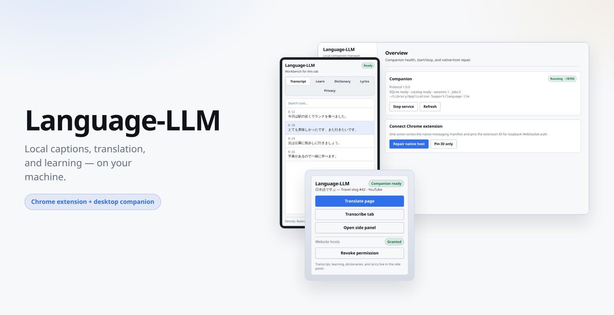
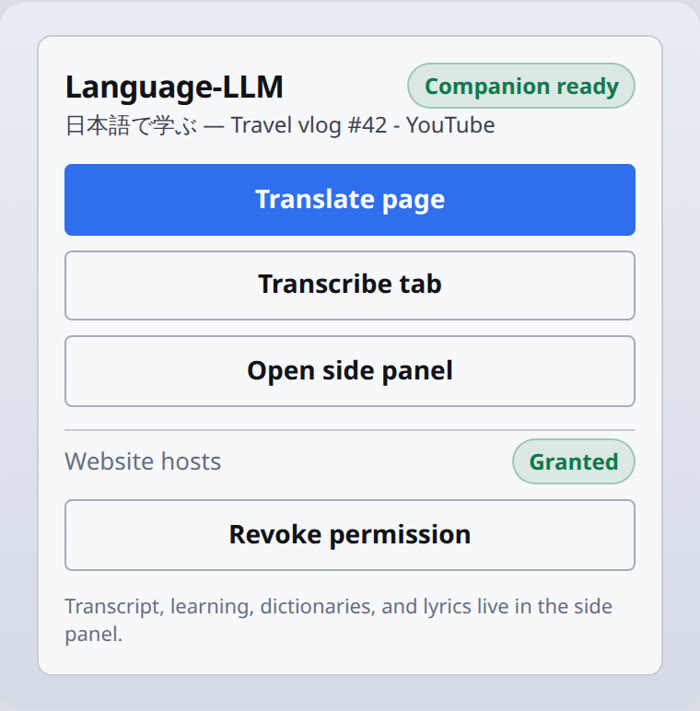
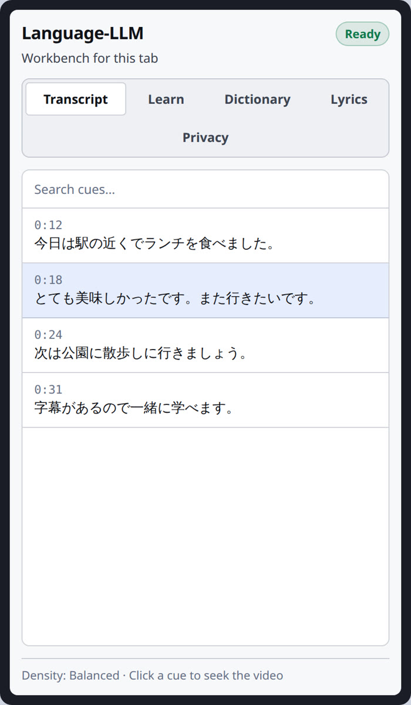
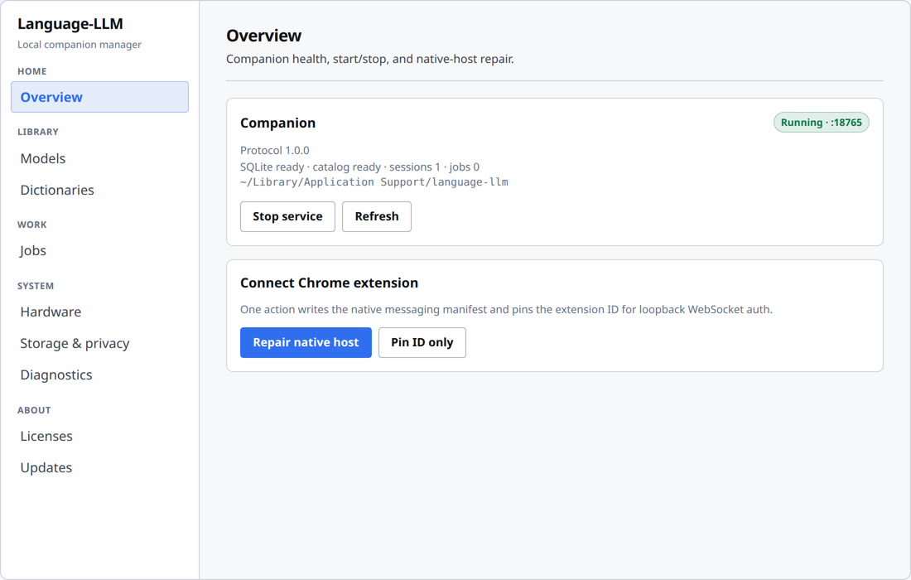

# Language-LLM

<p align="center">
  
</p>

<p align="center">
  <strong>Local-first Chrome extension + desktop companion</strong><br />
  Captions, translation, dictionaries, and study — inference stays on your machine.
</p>

<p align="center">
  <a href="./STATUS.md"></a>
  <a href="./CHANGELOG.md"></a>
  <a href="./LICENSE"></a>
  
</p>

Honest status lives in **[STATUS.md](./STATUS.md)**. This README is a map of the product — not a GA claim.

---

## What you get

Three surfaces, one local companion:

| Surface | Job |
| --- | --- |
| **Popup** | Launch translate / transcribe / side panel for the active tab |
| **Side panel** | Transcript, FSRS learning, dictionaries, lyrics, privacy |
| **Desktop manager** | Start companion, pin extension, models, jobs, hardware, wipe |

### Extension popup — launcher



One primary action, clear companion status, host permission in view. Privacy wipe stays out of the way under optional shortcuts.

```text
Translate page  →  in-place DOM MT (local models / labeled OfflineMock)
Transcribe tab  →  user-initiated tab capture ASR
Open side panel →  transcript · learn · dictionary · lyrics · privacy
```

### Side panel — workbench



Tabbed IA so each job has one place:

- **Transcript** — searchable cues, seek on select  
- **Learn** — FSRS reviews when due  
- **Dictionary** — import + lookup  
- **Lyrics** — LRC/TTML import or attributed LRCLIB  
- **Privacy** — retention presets and scoped wipe  

Density profiles (**Focus / Balanced / Expert**) hide nonessential chrome when you want less noise.

### Desktop manager — companion control



Grouped navigation: Home · Library · Work · System · About. Overview shows health, start/stop, and one-click native-host repair.

```bash
pnpm --filter @language-llm/desktop tauri:dev   # Tauri 2 + --features gui
```

---

## Quick start

**Prerequisites:** Node.js ≥ 20 · pnpm 9 · Rust stable

```bash
corepack enable
corepack prepare pnpm@9.15.0 --activate
pnpm install
pnpm verify          # JS + Rust quality gates (see scripts/verify.mjs)
```

### 1. Companion (headless)

```bash
cargo run -p language-llm-desktop -- --serve
# stdout bootstrap JSON → port + bootstrapToken + protocolVersion
# health: http://127.0.0.1:<port>/health
# ws:     ws://127.0.0.1:<port>/v1?t=<bootstrapToken>
```

Auth: `auth.handshake.request` (`@language-llm/protocol`) → `sessionToken`.  
ASR / MT / page-translate use **real whisper/llama CLIs when verified weights are installed**; otherwise commercial paths use a labeled **OfflineMock**. Specialists return **model not installed** — never silent fake success.

SQLite defaults to the OS data dir under `language-llm/` (override with `LANGUAGE_LLM_DATA_DIR`).

### 2. Extension (unpacked)

```bash
pnpm --filter @language-llm/extension dev
# Load apps/extension/.output/chrome-mv3-dev in chrome://extensions
```

### 3. Native messaging

Host name: **`com.languagellm.companion`**

```bash
cargo build -p language-llm-desktop --release
# Load unpacked extension once, copy ID from chrome://extensions

# Windows
powershell -File apps/desktop/scripts/register-windows.ps1 -ExtensionId <id>

# macOS / Linux
./apps/desktop/scripts/register-macos.sh <id>
./apps/desktop/scripts/register-linux.sh <id>
```

Pin for release WS Origin checks: `LANGUAGE_LLM_EXTENSION_ID=<id>` or Overview → **Repair native host**.  
Scripts: [apps/desktop/scripts/README.md](./apps/desktop/scripts/README.md).

---

## Architecture

<p align="center">
  
</p>

```text
apps/extension     Chrome MV3 (WXT + React/TS)
apps/desktop       Tauri 2 manager + Rust companion (native messaging + loopback WS)
packages/*         protocol, ui, language-kits, page-translate, lyrics, learning, mt-core
crates/*           media-pipeline, inference-router, subtitle-core, local-store
models/catalog.json  license-aware router catalog (digests often PENDING_*)
docs/              ADRs, privacy, enterprise, troubleshooting, licenses
```

**Hard constraints**

- No automatic YouTube downloading  
- No proprietary lyric-site scraping  
- Commercially redistributable model defaults when packs are offered (Hy-MT2, MADLAD, Whisper, Qwen3.*, …)

Application source is MIT ([LICENSE](./LICENSE)). Model weights and dictionaries keep **upstream** licenses — [docs/licenses/model-matrix.md](./docs/licenses/model-matrix.md) · [docs/licenses/ATTRIBUTIONS.md](./docs/licenses/ATTRIBUTIONS.md).

---

## Product lanes

1. **YouTube language suite** — caption-first subtitles, user-initiated tab capture ASR, context-aware translation, dictionaries, learning  
2. **Website translate** — in-place DOM translation (local MT only)  
3. **Song lyrics** — store-safe karaoke path: captions → LRCLIB → import → ASR last  

Network is for explicit model/dictionary download, optional attributed LRCLIB fetches, and (when configured) signed updates.

### Overlay shortcuts

| Chord | Action |
| --- | --- |
| **S** | Source |
| **T** | Translation |
| **R** | Reveal |
| **M** | Mine |
| **K** | Known |
| **?** | Help |
| **Esc** | Blur |

Do not steal YouTube keys when the overlay is unfocused. Full list: [docs/troubleshooting.md](./docs/troubleshooting.md#accessibility-shortcuts).

---

## Local models

Weights are **not** committed. Until verified files land under `models/weights/<id>/` with a real SHA-256 (not `sha256:PENDING_*`) and a `.installed` marker, Whisper / Hy-MT2 / MADLAD stay on labeled offline mocks.

```text
<repo-or-LANGUAGE_LLM_DATA_DIR>/
  models/catalog.json
  models/bin/                          # optional: whisper-cli / llama-cli
  models/weights/<model-id>/
    model.gguf
    .installed                         # only after digest verify
```

Details: [models/README.md](./models/README.md).

---

## Status legend

| Label | Meaning |
| --- | --- |
| **Implemented** | In-repo path with tests or intentional smoke wiring |
| **Development fallback** | Labeled mock/stub when weights/CLIs/pins are absent |
| **Weights-required** | Needs verified local weights + CLIs |
| **Manually verified** | Human / real-browser gate recorded |
| **Deferred** | Store credentials, notarization, native-speaker QA, ops |

Live YouTube SPA caption behavior and gesture-gated `tabCapture` are **not** claimed as manually verified in CI — see [STATUS.md](./STATUS.md).

UI preview images under `docs/assets/readme/` reflect the **v0.1.1** product shell (accurate chrome + example copy).

---

## Docs & community

| Doc | Purpose |
| --- | --- |
| [STATUS.md](./STATUS.md) | Implemented vs fallback vs weights vs manual vs deferred |
| [CHANGELOG.md](./CHANGELOG.md) | Release notes |
| [docs/architecture](./docs/architecture/README.md) | ADRs, threat model, fidelity, source policy |
| [docs/privacy.md](./docs/privacy.md) | Retention, wipe, uninstall |
| [docs/troubleshooting.md](./docs/troubleshooting.md) | IDs, companion, models, a11y |
| [docs/enterprise-chrome.md](./docs/enterprise-chrome.md) | Enterprise / force-install |
| [docs/licenses/model-matrix.md](./docs/licenses/model-matrix.md) | License posture |
| [apps/desktop/README.md](./apps/desktop/README.md) | Tauri manager modes |

[CONTRIBUTING.md](./CONTRIBUTING.md) · [CODE_OF_CONDUCT.md](./CODE_OF_CONDUCT.md) · [SECURITY.md](./SECURITY.md)
