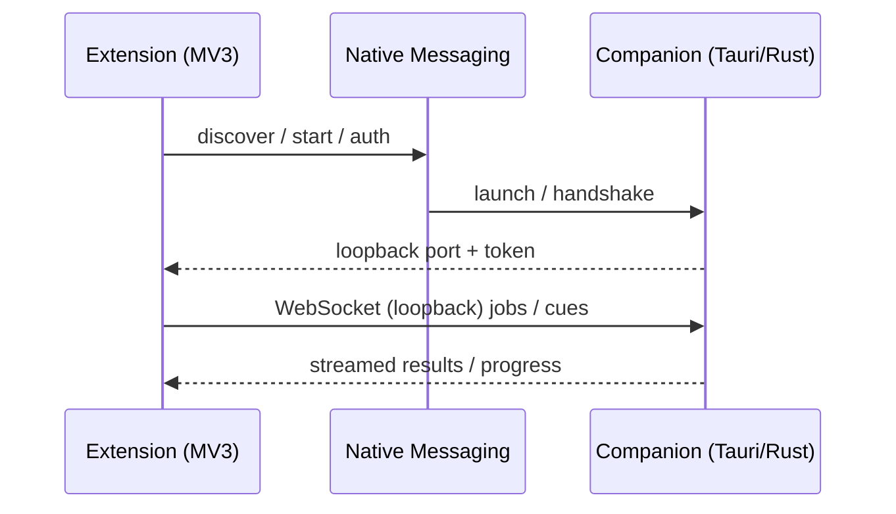

# ADR-001: Runtime Boundaries

**Status:** Accepted  
**Date:** 2026-07-16  
**Deciders:** Product architecture (Phase 0 freeze)

## Context

The Local YouTube Language Suite must inject an accessible subtitle layer on every YouTube watch page, reuse caption tracks when present, run local ASR and translation when needed, and keep transcripts, audio snippets, models, dictionaries, and study data on the user’s machine.

Two hard constraints shape the runtime split:

1. **Chrome extension limits.** Manifest V3 service workers are ephemeral, remote code execution is forbidden for store distribution, and a browser extension cannot efficiently host multi-billion-parameter models, GPU schedulers, or large model-file managers by itself.
2. **Chrome native messaging payload caps.** Host→extension native messaging is capped at **1 MB** per message. Streaming ASR chunks, cue timelines, model progress, and cancel/resume events routinely exceed that budget.

Therefore the product is two cooperating runtimes: a thin Chrome MV3 extension for page integration, and a signed local companion for inference and storage.

## Decision

### Extension: Chrome MV3 + WXT

**Stack:** WXT + TypeScript + React, Manifest V3.

**Owns:**

- Minimal service worker (event router, native-host handshake, job recovery).
- Isolated content script and Shadow DOM UI (overlay, transcript rail, word inspector surfaces).
- Tiny audited MAIN-world page bridge for player/caption metadata.
- Offscreen document for **user-initiated** `chrome.tabCapture`.
- Popup, settings entry points, and side panel.
- Least-privilege permissions declared in the generated MV3 manifest.

**Does not own:** model download/verification, inference, SQLite persistence of transcripts/models/dictionaries, long-running media decode, or GPU/CPU job scheduling.

### Companion: Tauri 2 / Rust

**Stack:** Tauri 2/Rust shell for Windows, macOS, and Linux.

**Owns:**

- Installer and native-messaging host registration.
- Signed model manager (catalog, hashes, licenses, updates).
- SQLite / content-addressed local store.
- Media pipeline (decode, resample, VAD, chunking).
- Inference scheduler and hardware probe.
- Loopback-only HTTP/WebSocket API.
- Optional allowlisted Python workers for NeMo/PyTorch-only packs.

**Inference backends (inside the companion, not the extension):**

| Backend | Role |
| --- | --- |
| `llama.cpp` | GGUF text/VLM across CPU, Metal, CUDA, HIP, Vulkan, SYCL |
| `whisper.cpp` | Universal ASR baseline |
| ONNX Runtime | Portable speech/NLP packs |
| Optional Python/CUDA or MLX workers | Only where a chosen model requires them |

### Why the extension alone cannot host large models

- Multi-billion-parameter ASR/MT/VLM packs need tens of GB of disk, quantified RAM/VRAM headroom, and sustained compute—not a short-lived service worker or content-script sandbox.
- Extension storage (`chrome.storage`) is for lightweight prefs and session state, not model weights, dictionaries, or long transcripts.
- Store policy forbids shipping or evaluating remote executable model code inside the extension; native binary runtimes belong in a signed companion.
- Hardware probing, thermal/memory co-residency, and sequential job scheduling are OS-level concerns; the companion owns them.

### IPC: native messaging bootstrap + loopback WebSocket

**Bootstrap (native messaging):**

1. Extension discovers/registers the native host and starts or reconnects the companion.
2. Companion returns connection metadata (loopback port, protocol version, short-lived capability).
3. Native messaging is **not** the data plane for cues or audio—it exists because the 1 MB host→extension cap makes it unsuitable for streaming.

**Data plane (loopback WebSocket):**

- Bind **only to loopback** on a random port.
- Authenticate with a **short-lived 256-bit** session token issued at bootstrap.
- Enforce **extension-origin** checks and protocol schema versioning.
- Support backpressure, cancellation, and reconnect/resume.
- Reject browser-page origins; only the signed extension may hold the capability.

### Media acquisition order (policy-aligned)

The extension/companion pair must implement this order and no other automatic YouTube download path:

1. **Caption-first:** read the caption track already delivered to the open watch page (prefer human-authored, then user-selected, then auto-generated; preserve provenance).
2. **User-initiated `tabCapture`:** only if no usable caption exists, and only after one explicit click (“Transcribe this tab”); show capture as active; keep audio in bounded ring buffers unless the user enables temporary disk buffering.
3. **Owned-media import:** file import or owner-authorized processing for media the user owns or is allowed to process.

No BotGuard/PoToken circumvention in the store build. No `captions.download` for third-party videos. Details: [source-policy.md](./source-policy.md).

## Consequences

**Positive**

- Store-safe page integration with real local model capacity.
- Streaming without hitting native-messaging size limits.
- Clear trust boundary: page → extension → native messaging → loopback WS → companion → model files ([threat-model.md](./threat-model.md)).
- Offline inference after first-time asset download.

**Negative / accepted costs**

- Requires a signed native installer and OS-specific native-host registration.
- Two-process reconnection, version skew, and handshake testing overhead.
- Users must install the companion; extension-only install is insufficient for ASR/MT.

## Related documents

- [ADR-002: Model Routing](./ADR-002-model-routing.md)
- [Threat model](./threat-model.md)
- [Source policy](./source-policy.md)
- [Architecture index](./README.md)
