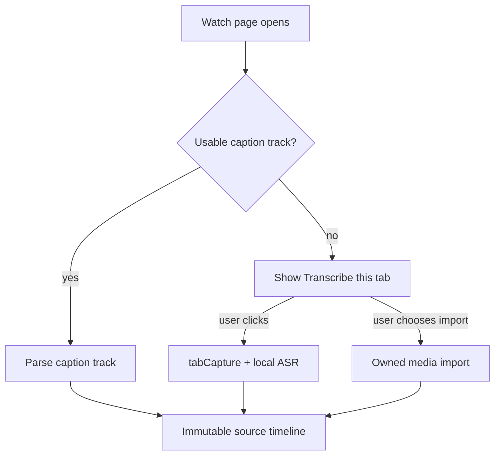

# Source Acquisition Policy

**Status:** Phase 0 freeze  
**Date:** 2026-07-16  
**Audience:** Engineering, product, legal review, Chrome Web Store submission authors

## Non-negotiable rule

**Automatic background downloading of arbitrary YouTube videos is forbidden** in this product—including store builds, private betas, and default companion configurations.

YouTube’s Terms restrict downloading except where permitted. The YouTube Data API can download captions only for videos the user can **edit**. Chrome Web Store policy explicitly cites YouTube downloading as a **rejection reason**. This product must not recreate a downloader under a language-learning guise.

## Compliant acquisition order

Implement exactly this order. Do not add silent fallbacks that skip user consent or invent download paths.

### 1. Caption track already on the open watch page

- Detect SPA navigation, video ID changes, Shorts/live/premiere states, language changes, and player replacement without polling the whole DOM.
- Prefer **human-authored** captions, then **user-selected**, then **auto-generated**; preserve source labels and provenance.
- Read player-delivered track metadata through the audited MAIN-world bridge and fetch the signed track URL from the **page session**.
- Treat the adapter as undocumented and brittle: isolate it, maintain fixtures, detect empty responses, and **fail visibly** rather than storing blank captions.
- Keep original source cue text **immutable**. Normalization, readings, and translations are separate derived layers with provenance and revision IDs.

### 2. User-initiated `tabCapture` (explicit click)

- Only when no usable caption track exists (or the user explicitly chooses live transcription over captions).
- Require **one clear action** (e.g. “Transcribe this tab”).
- Show that capture is **active** for the entire session.
- Retain audio only in bounded **memory/ring buffers** unless the user explicitly enables temporary disk buffering; delete temporary chunks immediately after ASR by default.

### 3. Owned-media import

- Local file import and owner-authorized processing for media the user owns or is allowed to process.
- Do **not** imply that YouTube Premium downloads can be accessed by the extension or companion.

## Explicit prohibitions (store build)

| Prohibited | Rationale |
| --- | --- |
| Automatic YouTube **video** download / mirroring | ToS + CWS rejection risk |
| **BotGuard / PoToken circumvention** | Anti-abuse bypass; store and ToS risk; expands attack surface |
| Official **`captions.download`** for **third-party** videos | API requires edit permission; misuse is non-compliant |
| Background capture without UI indicator | Consent and product-gate violation |
| Shipping a “full offline YouTube library” feature | Same download prohibition |

Research or fork experiments that violate this policy must not be merged into the store-distributed branch.

## Chrome Web Store rejection risk language

When drafting store listing, privacy policy, and reviewer notes, use language consistent with this policy:

- The extension **reuses caption tracks already delivered** to the watch page for overlay and study features.
- If captions are unavailable, transcription runs **locally** on audio obtained only after **explicit user initiation** of tab audio capture, or on **files the user provides**.
- The product **does not download YouTube videos**, does not bypass YouTube access controls, and does not offer bulk retrieval of YouTube media.
- Heavy processing occurs in a **user-installed local companion**; inference and transcripts remain on-device after optional first-time model download.

Avoid phrases that reviewers associate with downloaders (“save video,” “offline MP4,” “grab stream URL,” “bypass restrictions,” “download any video”).

Product gates (verification):

- Existing-caption videos **never** start audio capture or ASR automatically.
- No-caption capture **cannot** begin without explicit user action and always shows a persistent active indicator.

## Website translate (pillar)

- Translate page text **only with local MT**. Do not send page HTML/text to remote translation APIs.
- Prefer `activeTab` + user gesture; optional host permissions only for user-enabled always-on sites.
- Original text must remain recoverable (Original / Translated / Dual modes).
- Cache by URL + model revision in the companion; user can clear.

## Song lyrics (pillar)

Compliant priority only — **never scrape proprietary lyric sites** (Genius, Musixmatch, LyricFind UIs, etc.):

1. Page-delivered captions / embedded lyrics
2. Open APIs (e.g. LRCLIB) with attribution, user-initiated or explicit preference, clearable cache
3. User LRC / TTML / plain import
4. User-initiated local ASR last

## Related API / policy references (external)

- [Chrome Extensions documentation](https://developer.chrome.com/docs/extensions/) — MV3, offscreen/tabCapture, native messaging, Web Store policies
- [YouTube Terms of Service](https://www.youtube.com/static?template=terms)
- [YouTube Captions download API](https://developers.google.com/youtube/v3/docs/captions/download)
- [LRCLIB](https://lrclib.net/) — open lyrics API (attribution required)

## Related documents

- [ADR-001: Runtime Boundaries](./ADR-001-runtime-boundaries.md)
- [ADR-003: Website translate](./ADR-003-website-translate.md)
- [ADR-004: Song lyrics](./ADR-004-song-lyrics.md)
- [Threat model](./threat-model.md)
- [Fidelity contract](./fidelity-contract.md)
