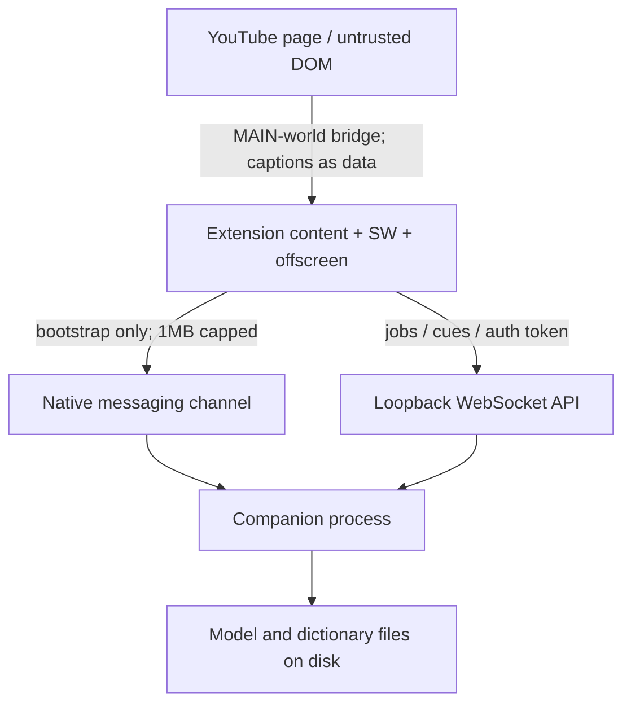

# Threat Model

**Status:** Phase 0 freeze (contracts); see [`STATUS.md`](../../STATUS.md) for implementation labels  
**Date:** 2026-07-16  
**Scope:** Extension (Chrome MV3 / WXT) + local companion (Tauri 2 / Rust) for Local YouTube Language Suite

## Purpose

Document assets, trust boundaries, threats, and mitigations. Local-first does not mean zero attack surface: untrusted YouTube page content, caption text used as model input, model/dictionary supply chain, and a privileged companion process are in scope.

**Honesty note:** Mitigations such as “signed companion binaries” and “signed model catalogs” are **design targets**. As of the Phase 3B docs refresh, updater signing secrets and live Ed25519 catalog verification remain **Deferred** / unconfigured — loopback WS auth, Origin/extension pin, digest gates, and SQLite wipe/retention are the **Implemented** controls.

## Assets

| Asset | Sensitivity | Notes |
| --- | --- | --- |
| **Transcripts & translations** | High | May contain private speech content; stored in companion SQLite / content-addressed files |
| **Audio ring buffers / temp chunks** | High | Live `tabCapture` audio; default: memory-only rings; delete immediately after ASR unless user enables temp disk buffering |
| **Model & dictionary weights** | Medium–High | Integrity and license class; large disk; never execute repo-supplied code |
| **Study data** (FSRS, mined sentences, known words, progress) | High | Local-only learning history with provenance |
| **Session tokens / capabilities** | Critical | Short-lived 256-bit tokens authorizing loopback WebSocket |
| **User glossary & translation memory** | High | Per-video terminology; may include private terms |
| **Screenshots / optional cue audio** | High | Only with explicit consent; treated as sensitive media |
| **Install integrity / update channel** | Critical | Signed companion binaries and signed model manifests |

Lightweight preferences may live in `chrome.storage`; they are not substitutes for transcript/model storage.

## Trust boundaries

| Boundary | From → To | Expected trust |
| --- | --- | --- |
| YouTube page | Page → extension | **Untrusted.** Player DOM, captions, titles, and descriptions are adversarial inputs. |
| Extension | Content/SW ↔ companion via native messaging | Semi-trusted bootstrap only; not the streaming data plane. |
| Loopback WebSocket | Extension ↔ companion | Authenticated local channel; still validate origin, token, schema, sizes. |
| Companion internals | Scheduler → workers → store | Trusted compute; still path-cap, sandbox Python, allowlist adapters. |
| Model files | Disk → loader | Supply-chain risk; verify SHA-256 and signed catalog before load. |

Reject **browser-page origins** as WebSocket clients. Only the signed extension holds the session capability.

## Threats and mitigations

### Malicious or compromised pages

- **Threat:** Hostile page scripts attempt to exfiltrate captions, trigger ASR, or confuse the MAIN-world bridge.
- **Mitigations:** Minimal audited MAIN-world bridge; isolated content script + Shadow DOM UI; never expose companion tokens to page JS; treat all page-derived text as untrusted data.

### Prompt injection via captions / ASR text

- **Threat:** Caption or transcript text contains instructions that steer MT/VLM into leaking policies, ignoring glossary constraints, or inventing certainty.
- **Mitigations:** Treat **all source text as quoted data**; structured schemas for draft/review; fidelity checks outside the LLM ([fidelity-contract.md](./fidelity-contract.md)); VLM only on flagged spans with narrow questions—never “translate the whole scene.”

### Model / dictionary supply chain

- **Threat:** Tampered weights, unexpected executable payloads, license-violating default packs.
- **Mitigations:** Signed catalog; SHA-256 verification; prefer safetensors/GGUF/ONNX; **never execute code** downloaded from a model repository; CI rejects releases missing approved license metadata or shipping non-commercial packs as defaults ([model-matrix.md](../licenses/model-matrix.md)).

### Token theft / local session hijack

- **Threat:** Another local process or page obtains the WebSocket capability and drives jobs or reads transcripts.
- **Mitigations:** Loopback-only bind; random port; **short-lived 256-bit** tokens; extension-origin + protocol version checks; reject non-extension origins; rotate on reconnect.

### Path traversal / oversized jobs

- **Threat:** Malicious job params walk outside allowlisted media/model dirs or exhaust disk/memory.
- **Mitigations:** Cap file paths and job sizes; content-addressed stores; sandbox optional Python workers; allowlist model adapters; disk budget / LRU policies.

### Caption / store-policy abuse as security+compliance risk

- **Threat:** Building automatic YouTube video download or BotGuard/PoToken circumvention expands legal and CWS rejection risk and increases privileged code.
- **Mitigations:** Caption-first → user-click `tabCapture` → owned-media only ([source-policy.md](./source-policy.md)).

### Telemetry / unexpected egress

- **Threat:** Accidental network calls after model install leak content or metadata.
- **Mitigations:** **No telemetry by default**; offline privacy CI that fails on unexpected outbound calls; diagnostic export is opt-in, redacted, and never includes transcripts/audio.

---

## STRIDE-style summary

| STRIDE | Example threat | Primary mitigations |
| --- | --- | --- |
| **S**poofing | Fake client claims to be the extension | Extension-origin checks; short-lived 256-bit tokens; native-messaging bootstrap only from registered host |
| **T**ampering | Altered model weights or catalog | Signed catalog + SHA-256; signed companion updates; immutable source cue layers with revision IDs |
| **R**epudiation | Unclear whether capture was user-initiated | Explicit UI action + persistent “capture active” indicator; auditable job provenance (local) |
| **I**nformation disclosure | Page or third process reads transcripts/tokens | Loopback-only API; tokens never to page JS; encrypted backup/export optional; no default telemetry |
| **D**enial of service | Huge audio job / model load meltdown | Job size caps; sequential scheduling + memory headroom; cancel/resume; thermal/Battery policies |
| **E**levation of privilege | Page→extension→companion privilege chain | Least-privilege MV3 permissions; sandboxed Python; no remote code in store build; path allowlists |

## Residual risks (accepted for Phase 0)

- Undocumented YouTube caption adapters remain brittle; fail visibly rather than storing blank captions.
- Local malware with full OS privileges can always inspect process memory; we harden against unprivileged and cross-origin web attackers, not a compromised OS.
- Optional research packs increase user license footguns—mitigated by explicit opt-in screens, not by silent defaults.

## Related documents

- [ADR-001: Runtime Boundaries](./ADR-001-runtime-boundaries.md)
- [Source policy](./source-policy.md)
- [Model / data license matrix](../licenses/model-matrix.md)
